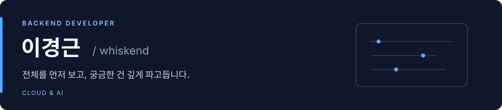

  

안녕하세요. 백엔드 개발자 이경근입니다. 
전체가 어떻게 돌아가는지 먼저 보고, 궁금한 부분은 직접 만들고 설명해보며 익힙니다.

지금까지 만든 것과 그 과정에서 고친 문제를 아래에 정리했습니다.

[Blog](https://velog.io/@lgg007/posts) · [Algorithm](https://github.com/whiskend/Algorithm)

## Projects

### [AI Workout Board](https://github.com/whiskend/ai-workout-board)

**개인 프로젝트 · 운동 기록을 남기고, 지난 기록과 비교해 다음 목표를 제안하는 게시판** 
`TypeScript` `NestJS` `PostgreSQL` `Python` `FastAPI`

- JWT 로그인과 글 작성자 권한 확인을 구현했습니다. 분석할 때는 같은 사람의 이전 운동 기록만 가져오도록 했습니다.
- '벤치'와 '벤치프레스'를 같은 운동으로 찾도록 이름을 맞췄습니다. AI 분석 호출이 실패하면 정해둔 규칙으로 결과를 만들게 했습니다.

[이전 기록 비교](https://github.com/whiskend/ai-workout-board/pull/21) · [운동명 정규화](https://github.com/whiskend/ai-workout-board/pull/22)

### [SketchCatch](https://github.com/NearthYou/SketchCatch)

**5인 팀 프로젝트 · AWS 구성을 그림으로 설계하고 배포하는 서비스** 
`TypeScript` `Node.js` `AWS` `Zod`

- 저는 기존 AWS 자원을 불러오는 기능과 GitHub 저장소 분석을 맡았습니다. 권한이 없어 못 읽은 자원은 '없음'으로 처리하지 않고 따로 표시했습니다.
- 불러온 구성이 화면에는 보이는데 저장이 안 되는 문제가 있었습니다. 화면에서 만든 데이터와 저장 API가 받는 형식을 맞춰 고쳤습니다.

[저장소 분석](https://github.com/NearthYou/SketchCatch/pull/317) · [AWS 조회](https://github.com/NearthYou/SketchCatch/pull/169) · [저장 오류 수정](https://github.com/NearthYou/SketchCatch/pull/573)

### [Pintos](https://github.com/whiskend/pintos_302_G1)

**팀 프로젝트 · C로 운영체제를 공부하며 구현한 과제** 
`C` `Virtual Memory` `Synchronization`

- 프로세스가 끝날 때 복사한 리스트 헤더를 따라가던 코드를 고쳤습니다. 실제 FD 리스트를 비우면서 열어둔 파일을 닫도록 바꿨습니다.
- 메모리를 확보하다 실패했을 때 앞에서 잡아둔 자원을 정리하는 코드를 손봤습니다. mmap의 입력값 검사와 페이지별 지연 로딩 정보 생성도 맡았습니다.

[FD 정리 수정](https://github.com/SISUinSea/Jungle-pintos_22-04_lab/commit/57649ebbdfa36f9fff63f305a55d5a364799c329) · [claim 실패 처리](https://github.com/whiskend/pintos_302_G1/pull/87) · [mmap 구현 기여](https://github.com/whiskend/pintos_302_G1/pull/98)

### [Mini GPT Lab](https://github.com/cloud-9-git/gpt-lab)

**팀 학습 프로젝트 · 토크나이저부터 작은 GPT 모델까지 함께 만든 실습** 
`Python` `PyTorch` `Byte-level BPE` `Transformer`

- 한 화면을 보며 토크나이저와 모델, 학습 코드를 함께 짜고 검토했습니다.
- 실험에서는 loss가 줄어도 생성 문장이 여전히 어색했습니다. 실제 문장과 분류 결과를 같이 확인했고, 예상과 다르게 나온 결과도 남겼습니다.

[토크나이저 공동 작업](https://github.com/cloud-9-git/gpt-lab/pull/1) · [모델 공동 작업](https://github.com/cloud-9-git/gpt-lab/pull/4)

---

공부한 내용은 [블로그](https://velog.io/@lgg007/posts)에, 알고리즘 풀이는 [저장소](https://github.com/whiskend/Algorithm)에 남깁니다.
